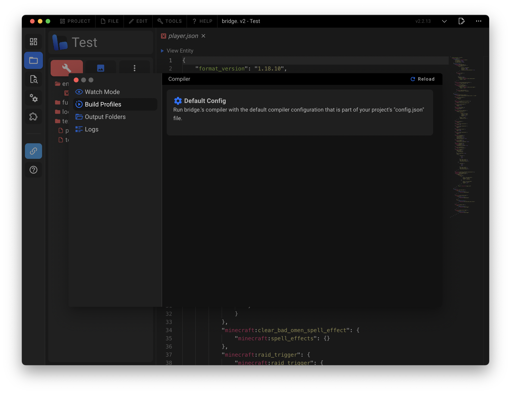

# ⚡️ Dash

This page serves as an introduction to bridge.'s compiler Dash and its functionality.
You will learn about the following topics inside of this article:

:ballot_box_with_check: What is Dash?<br/>
:ballot_box_with_check: How to run Dash.<br/>
:ballot_box_with_check: How to configure different build profiles.<br/>
:ballot_box_with_check: How to write plugins for Dash.<br/>

## Basics

[Dash](https://github.com/bridge-core/dash-compiler/) is the default compiler all bridge. projects use. It powers custom syntax such as [custom components](/guide/advanced/custom-components), [custom commands](/guide/advanced/custom-commands) and [molang files](/guide/advanced/molang-files). Additionally, Dash is also responsible for moving your compiled projects to the com.mojang folder.

:::tip
A compiler is a program that takes a source file, applies a set of transformations to it and writes the result to a destination file.
:::

### Built-in Dash

As bridge. comes with Dash built-in, you do not need to install or setup it yourself. We are going to refer to this variant of Dash as "built-in Dash".

### Standalone Build

You can also run a standalone build of Dash. This build is orders of magnitudes faster than the built-in version Dash and it can be used independently of bridge.
We are going to refer to this variant of Dash as "standalone Dash".

:::warning
You should only use the standalone version of Dash if you are familiar with terminal commands.
:::

The standalone build of Dash is also open-source and can be found on GitHub: [bridge-core/deno-dash-compiler](https://github.com/bridge-core/deno-dash-compiler).

#### Installation

There are multiple ways to install the standalone version of Dash. For the most convenient experience, make sure that you have [Deno](https://deno.land/) installed.

1. Open a terminal and navigate to your project's root directory
2. Run `deno task setup`. This command installs Dash as a terminal command
3. You can now use the standard `dash_compiler` commands or run the shorthand `deno task watch` and `deno task build`

#### Watch Command

Watch for changes to your project and recompile. Outputs to com.mojang if Minecraft is installed on your computer.

```bash
    dash_compiler watch
    # Or configure options
    dash_compiler watch --out preview --reload 4350
```

| Option            | Default           | Description                                                                                             |
| ----------------- | ----------------- | ------------------------------------------------------------------------------------------------------- |
| `--out [path]`    | com.mojang folder | Configure the output directory. Use `--out preview` to output to Minecraft Preview directory            |
| `--reload [port]` | 8080              | Open a web socket server that will reload scripts and functions when you connect to it within Minecraft |

#### Build Command

Build your project. Outputs to "builds/dist" folder within your project's root directory.

```bash
    dash_compiler build
    # Or configure options
    dash_compiler build -m development -c path/to/config.json
```

| Option                               | Alias | Description                | Description                                                      |
| ------------------------------------ | ----- | -------------------------- | ---------------------------------------------------------------- |
| `--mode [development \| production]` | `-m`  | "production"               | Tell bridge. whether to create a production or development build |
| `--compilerConfig`                   | `-c`  | Loaded from project config | Use a different compiler config to load your plugins             |

## Running Dash

### Compiler Window

If you run the built-in version of Dash, you can make use of bridge.'s compiler window to configure Dash.
Simply open the compiler window by clicking on the corresponding sidebar icon:


### Watch Mode

By default, Dash will watch any changes you make within bridge. and recompile affected files. You can disable this behavior within the compiler window.

<!-- TODO: Add image -->

### Production Builds

Whenever you [export your project](/guide/misc/export-project), bridge. uses Dash to create a production build of your project. You can also manually request a production build that outputs to the "builds/dist" folder by using the compiler window. Simply select the "Default Config" within the "Build Profiles" tab.



Production builds can be configured with plugins to produce an optimized output.

**Examples:**

-   Remove comments
-   Minify files
-   Remove debug messages

## Build Profiles

### Default Profile

TODO: Explain how to configure the default profile.

### Adding New Profiles

TODO: Explain how to use compiler configs

## Writing Plugins

TODO: Explain how to write plugins for dash & link to dedicated plugin docs
