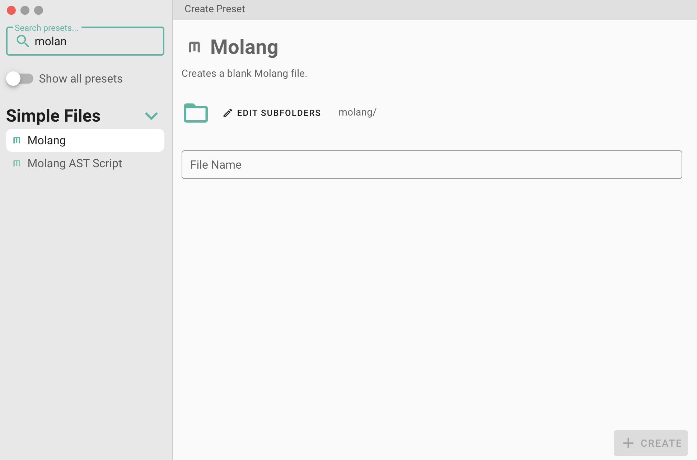

# ∿ Molang Files

This page serves as an introduction to bridge.'s Molang files and how you can utilize them to extract common scripts into a single file.

This article teaches you the following topics:

:ballot_box_with_check: What is a Molang file?<br/>
:ballot_box_with_check: How to use Molang files.<br/>
:ballot_box_with_check: How to use Molang functions.<br/>

## Basics

[Molang](https://bedrock.dev/docs/stable/Molang) is Minecraft's scripting language. It is used within items, blocks, animations and many more of Minecraft's JSON files.

bridge. supports extracting common Molang scripts into dedicated ".molang" files: Simply create a new Molang file over bridge.'s file creation window to get started.



The ["molang" compiler plugin](/guide/advanced/dash/#molang) loads Molang files from the `BP/molang/` and `RP/molang/` folder. The above preset creates the `molang/` folder and your first ".molang" file for you.

:::warning
Make sure that the "molang" plugin is listed within your [compiler config](/guide/advanced/dash/index.html#build-profiles) in order to use ".molang" files.
:::

## Molang Functions

Molang files can contain multiple Molang functions. Functions defined within a Molang file can be accessed anywhere within your project. To define a function, the following syntax is used:

```javascript
function('sq', 'base', {
	return math.pow(a.base, 2);
});

function('pow', 'base', 'exp', {
	return a.exp == 0 ? 1 : a.base * f.pow(a.base, a.exp - 1);
});
```

-   The first argument always defines the function name
-   All following arguments except the last one define input arguments
-   The last argument is the function body
-   Within the function body you can use `a.<ARG NAME>` or `arg.<ARG NAME>` to access the input arguments
-   Temporary variables get scoped to the current function body automatically
-   Basic recursion is supported as long as the interpreter can stop the recursive calls at compile-time

To later call functions inside of Molang scripts, simply use `f.<FUNCTION NAME>(<FUNCTION ARGUMENTS>)` or `function.<FUNCTION NAME>(<FUNCTION ARGUMENTS>)`. After defining the functions in the example above, you could call `f.sq(2)` or `f.pow(3, 2)`.

```json
{
    ...,
    "transitions": [
        { "default": "f.sq(v.my_var) > 4" }
    ]
}
```

## Technical Implementation

Molang files are powered by our [Molang libarary](https://github.com/bridge-core/molang/) and the built-in "molang" compiler plugin. Our molang library is also open-source and licensed under the MIT license.
