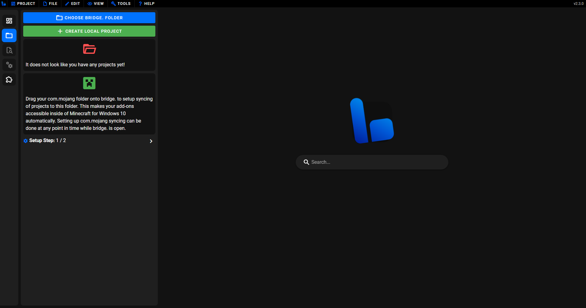
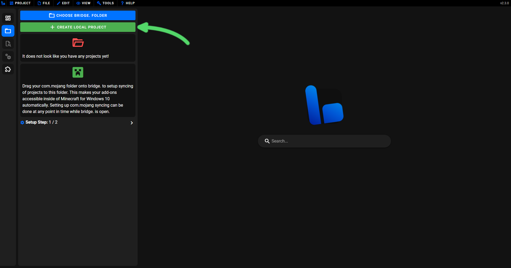

# 👣 Getting Started

Whether you are a newcomer to bridge., or to Add-Ons as a whole, this guide will serve as an introduction to get you comfortable with setting up and using bridge. This page is designed to be read in order, however if you already know something, feel free to skip to the next section.

In this guide, you will learn:

:ballot_box_with_check: How to set up a bridge.<br/>
:ballot_box_with_check: How to set up a project.<br/>
:ballot_box_with_check: How to get started with creating an Add-On with bridge.<br/>

## Installation

bridge. can be used in a few ways across many platforms, due to its design as a **Progressive Web App**. The essentially means you can use bridge. on almost any device that has a modern browser, such as Chrome and Edge on desktop, or Chrome and Safari on Android and IOS.

We have a seperate [guide on how to install bridge. to your device](/guide/download/index), providing you are using a browser that supports doing so. You can also use bridge. directly in your browser at https://editor.bridge-core.app/.

:::tip
Please note that the installation is not in the traditional sense of installing through an `.exe` file, but bridge. will still behave like a native app and work offline once installed.
:::

## Setting Up bridge.

When you open bridge. for the first time, you will be greeted by a setup process, that will vary slightly, depending on the browser that you are using. 



Simply follow the instructions on screen. They will consist of the following:

- 🖥️ [Link the `com.mojang` folder](/guide/misc/com-mojang-syncing/index) by dragging it onto bridge.
- 🖥️📱 Select which editor type to use; tree editor or text editor.
- 🖥️ Choose a bridge. folder by pressing `Choose bridge. Folder` and selecting an empty folder. This is where bridge. will store your project data.

🖥️ - _Desktop_<br/>
📱 - _Mobile_ <br/>

:::tip
The `com.mojang` folder can be linked anytime, not just during setup.
:::

## Creating a Project

Before creating a project, you should be aware of the different [project types](/guide/misc/project-types/index) that bridge. supports. Here, we will go through creating a [Local Project](/guide/misc/project-types/index.html#local-project), as they are available on every browser and platform that bridge. supports.

Start by pressing the "Create Local Project" button.



Then you will see the following project creation window:


In this menu, you should input the details of the project that you are creating. This includes:

- The icon, name and description of the project, to identify the project within bridge.'s UI.
- The experimental toggles that you are using in your project and the target Minecraft version of your project. These are essential as they modify what you should be able to in bridge.
- The different types of packs to add to the project.

:::warning
Do not forget to scroll down in the project creation window, as you may miss some inputs!
:::

The project structure that bridge. generally follows is the following:

```
.
├─ 📁 PROJECT_NAME
│  ├─ 📝 config.json
│  ├─ 📁 BP
│  ├─ 📁 RP
│  ├─ 📁 SP
│  ├─ 📁 WT
│  ├─ 📁 builds
│  └─ 📁 .bridge
```

:::tip
In the [project config](/guide/misc/project-config.html#packs) you can modify the paths of the behavior pack, resource pack, skin pack and world template, with the `packs` property.
:::

## Creating Files

TODO

## Editing Files

TODO

## Need Help?

If you have more questions about bridge., or creating Add-Ons, feel free to ask in the [official bridge. Discord server](https://discord.gg/jj2PmqU). Also, check out our [community page](/guide/community) for more useful links.


:::tip
Now that you've covered the basics, why don't you check out bridge.'s powerful [extension API](/extensions/index)!
:::