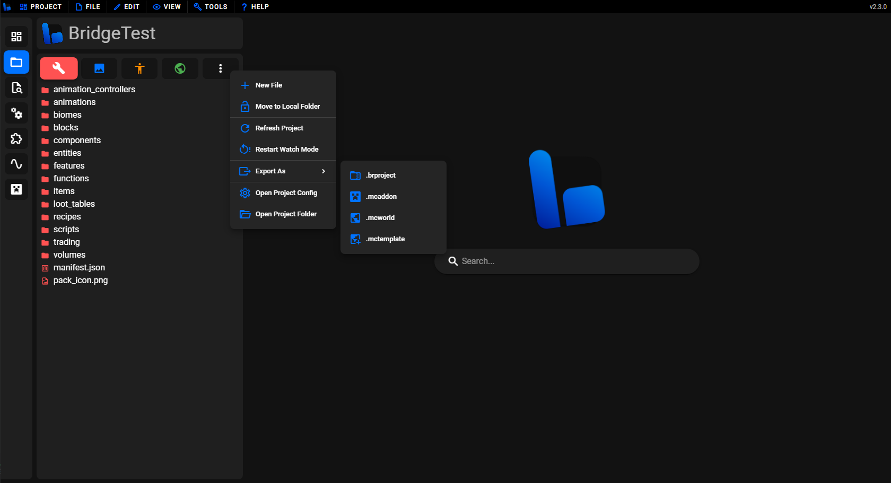

# 📦 Exporting Projects

When you are ready to share your creation with others, you can use bridge. natively supported export formats. In this article you will find out:

:ballot_box_with_check: How to export a project from bridge. 
:ballot_box_with_check: Details on how projects are exported. 

## Export Your Project

It is important to note that you do **not** need to export your project to test your changes if you are on a Chromium based desktop browser, such as Chrome or Edge on destop. Instead you should set up [syncing to your `com.mojang` folder](/guide/misc/com-mojang-syncing/), so that your changes automatically appear in Minecraft.

In order to export a project you need to open the **Export As** menu; you can find this by opening the menu under the 3 dots in the pack explorer sidebar tab. This is shown in the following image:

Once you have opened this menu, it is as simple as selecting the format that you wish to export in. The default export options are:

-   `.brproject` exports as a full bridge. project which can be imported back into bridge.
-   `.mcaddon` exports the behavior and resource packs into a single package that can be imported into Minecraft and bridge.
-   `.mcworld` exports a behavior pack, resource pack and world into a single package that can be imported into Minecraft and bridge.
-   `.mctemplate` exports a behavior pack, resource pack, skin pack and world template into a single package that can be imported into Minecraft and bridge.

## How it works

When exporting your project into a format that should be imported to Minecraft, [Dash](/guide/advanced/dash/index) will compile a production build and it will be written to the exported package.

:::tip
You can configure bridge. to automatically increment the pack versions inside of each manifest in your project when exporting them. You can do this by navigating to bridge.'s settings, then going to the **Projects** tab and toggling the **Increment Version** option.
:::

bridge. extensions can also add new project export options by utilizing the [`@bridge/project` module](/extensions/scripts/project).
